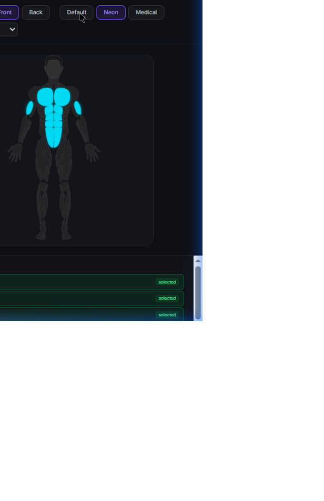
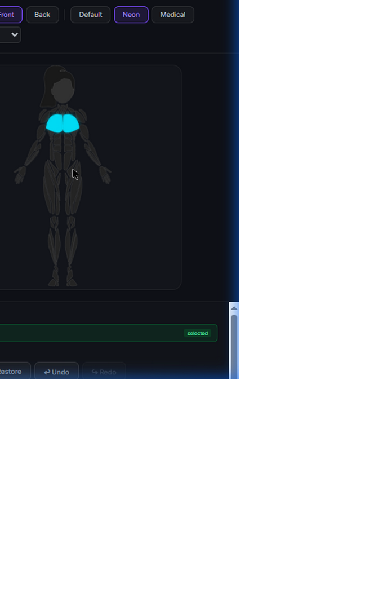
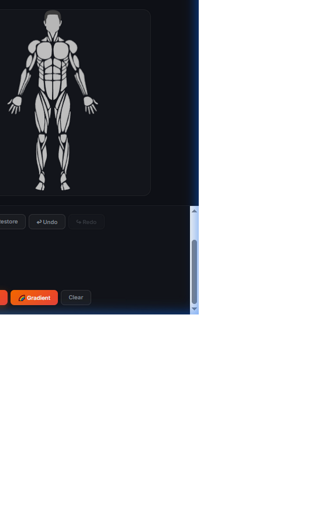
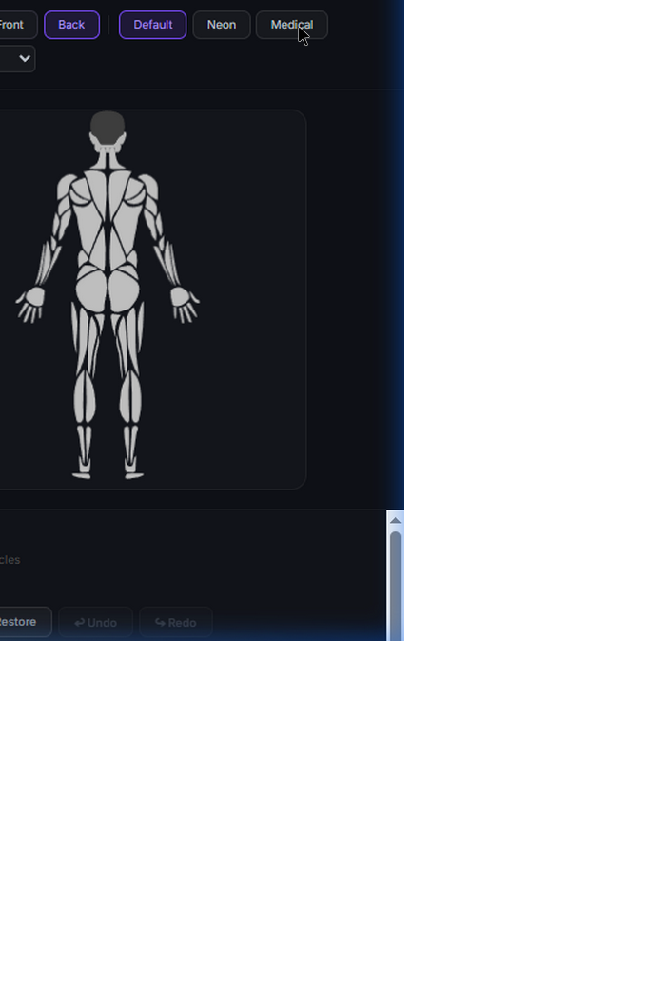

# MuscleMapJS

> **Interactive human body muscle map SDK for the web.**  
> TypeScript/Canvas port of the [MuscleMap SwiftUI SDK](https://github.com/melihcolpan/MuscleMap).

[](LICENSE)
[](https://www.typescriptlang.org/)
[](package.json)

<table>
  <tr>
    <td></td>
    <td></td>
  </tr>
  <tr>
    <td></td>
    <td></td>
  </tr>
</table>


---

## Features

- 🎨 **Canvas2D rendering** — crisp, DPR-aware drawing on HiDPI/Retina displays  
- 👤 **4 body models** — Male/Female × Front/Back, 86 body parts total  
- 💪 **36 muscles** — 22 base + 14 sub-groups (upper-chest, front-deltoid, inner-quad, etc.)  
- 🖱️ **Full interaction** — click, hover, long press (500ms), drag-to-select  
- 🌈 **Heatmap visualization** — 6 color scales, intra-muscle gradient fills, configurable interpolation  
- 💡 **Tooltip overlay** — positioned HTML tooltip above each muscle, custom renderer support  
- ↩️ **Undo / Redo** — selection history with configurable depth  
- ✨ **Animations** — smooth highlight cross-fade and sin-wave pulse on selected muscles  
- 🗺️ **Legend component** — `HeatmapLegend` color bar (horizontal/vertical)  
- 🌍 **11 locales** — Arabic, Chinese, English, French, German, Japanese, Korean, Portuguese, Russian, Spanish, Turkish  
- 🎨 **4 style presets** — Default, Minimal, Neon, Medical  
- 💾 **State serialization** — save/restore highlighted muscles as plain JSON  
- **Zero dependencies** — pure browser Canvas2D + DOM APIs

---

## Quick Start

```html
<!-- Add a sized container -->
<div id="muscle-map" style="width: 400px; height: 600px;"></div>

<script type="module">
  import { MuscleMapWidget } from './MuscleMapJS/src/index.ts';

  const map = new MuscleMapWidget(document.getElementById('muscle-map'), {
    gender: 'female',
    side: 'front',
    style: 'default',
    multiSelect: true,
  });

  // Listen for muscle clicks
  map.on('muscleClick', (muscle, side) => {
    console.log(`Selected: ${muscle} (${side})`);
  });

  // Get selection for saving to DB
  document.querySelector('#save').addEventListener('click', () => {
    const data = map.getHighlightData();
    // → [{ muscle: 'chest', color: '#00c853', opacity: 1 }, ...]
  });
</script>
```

> 💡 **Works out of the box with Vite, Astro, or any bundler that supports TypeScript imports.**

---

## Installation

### Via Git submodule (recommended for Astro/Vite projects)

```bash
git submodule add https://github.com/abdofallah/MuscleMapJS.git src/lib/MuscleMapJS
```

### Manual clone

```bash
git clone https://github.com/abdofallah/MuscleMapJS.git
```

Then import directly from the `src/index.ts` entry point.

---

## API Reference

### Creating a Widget

```typescript
const map = new MuscleMapWidget(container: HTMLElement, options?: MuscleMapOptions);
```

| Option | Type | Default | Description |
|--------|------|---------|-------------|
| `gender` | `'male' \| 'female'` | `'male'` | Body model gender |
| `side` | `'front' \| 'back'` | `'front'` | Body face to display |
| `style` | `StylePreset \| BodyViewStyle` | `'default'` | Visual theme |
| `interactive` | `boolean` | `true` | Enable pointer interactions |
| `multiSelect` | `boolean` | `true` | Allow selecting multiple muscles |
| `showSubGroups` | `boolean` | `false` | Show sub-group regions |
| `onMuscleClick` | `(muscle, side) => void` | — | Shorthand event listener |
| `onSelectionChange` | `(muscles) => void` | — | Shorthand event listener |

---

### Highlighting

```typescript
// Solid color
map.highlight('chest', '#ff4444', 0.9);
map.highlightMany(['biceps', 'triceps'], '#00c853');

// Gradients (ported from BodyView.swift modifiers)
map.highlightLinearGradient('abs', ['#ffeb3b', '#f44336'], 0, 0, 0, 1);
map.highlightRadialGradient('gluteal', ['#ff9800', '#f44336']);

// Raw MuscleHighlight object
map.setHighlight('chest', { muscle: 'chest', fill: { type: 'color', color: 'red' }, opacity: 1 });

// Removal
map.removeHighlight('chest');
map.clearHighlights();

// Inspection
map.getHighlightedMuscles();     // → Muscle[]
map.getHighlightData();          // → serializable array (for DB storage)
map.setHighlightData(saved);     // restore from DB
```

---

### Selection

```typescript
map.select('biceps');
map.selectMany(['chest', 'abs', 'obliques']);
map.deselect('chest');
map.toggleSelect('biceps');
map.clearSelection();
map.getSelectedMuscles();         // → Muscle[]
```

---

### Heatmap

```typescript
// Integer intensity (0–4 scale)
map.setIntensities({ chest: 4, biceps: 2, calves: 1 }, 'workout');

// Float intensity (0.0–1.0) with full config
map.setHeatmap([
  { muscle: 'chest', intensity: 0.9 },
  { muscle: 'quadriceps', intensity: 0.7 },
], {
  colorScale: 'thermal',          // 'workout' | 'thermal' | 'medical' | 'monochrome' | ...
  interpolation: { type: 'easeInOut' },
  threshold: 0.1,                 // skip muscles below this intensity
  gradientFill: true,             // use intra-muscle gradient
  gradientDirection: 'topToBottom',
  gradientLowFactor: 0.2,
});
```

**Available color scales:** `workout`, `thermal`, `medical`, `monochrome`, `workoutStepped`, `thermalSmooth`

---

### Heatmap Legend

```typescript
import { HeatmapLegend } from './MuscleMapJS/src/index.ts';

const legend = new HeatmapLegend(container, {
  colorScale: 'workout',
  orientation: 'horizontal',    // or 'vertical'
  barThickness: 16,
  labelMin: 'Low',
  labelMax: 'High',
  steps: 48,
});
```

---

### Tooltip

```typescript
// Default: shows muscle display name
map.enableTooltip();

// Custom HTML renderer
map.enableTooltip((muscle, side) => {
  return `<strong>${muscle}</strong><br><small>${side} side</small>`;
});

map.disableTooltip();
```

---

### Undo / Redo

```typescript
map.enableHistory(50);    // enable with max 50 entries

map.undo();               // → Muscle[] | null (restored selection)
map.redo();               // → Muscle[] | null

map.canUndo;              // → boolean
map.canRedo;              // → boolean
```

---

### Animations

```typescript
// Smooth cross-fade on highlight changes
map.enableAnimation(300);    // duration in ms
map.disableAnimation();

// Pulse effect on selected muscles
map.enablePulse(
  1.5,   // speed (cycles/sec)
  0.6,   // min opacity
  1.0,   // max opacity
);
map.disablePulse();
```

---

### Events

```typescript
map.on('muscleClick',     (muscle: Muscle, side: MuscleSide) => void);
map.on('muscleEnter',     (muscle: Muscle, side: MuscleSide) => void);
map.on('muscleLeave',     () => void);
map.on('selectionChange', (muscles: Muscle[]) => void);
map.on('muscleLongPress', (muscle: Muscle, side: MuscleSide) => void);
map.on('muscleDrag',      (muscle: Muscle, side: MuscleSide) => void);
map.on('muscleDragEnd',   () => void);

map.off('muscleClick', handler);
```

---

### Internationalization

```typescript
import { setLocale, getMuscleName, getUIString } from './MuscleMapJS/src/index.ts';

setLocale('ar');                         // Arabic
getMuscleName('chest');                  // → 'الصدر'
getMuscleName('biceps', 'ja');           // → '上腕二頭筋'
getUIString('legendLow');                // → 'منخفض'
```

**Supported locales:** `en` · `ar` · `de` · `es` · `fr` · `ja` · `ko` · `pt-BR` · `ru` · `tr` · `zh-Hans`

---

### Configuration

```typescript
map.setGender('female');
map.setSide('back');
map.setStyle('neon');          // 'default' | 'minimal' | 'neon' | 'medical'
map.setInteractive(false);
map.setLongPressDuration(700); // ms
map.getBoundingRect('chest');  // → { x, y, width, height } in CSS pixels
map.redraw();
map.destroy();                 // cleanup — removes canvas + listeners
```

---

## Style Presets

| Preset | Fill | Selection | Shadow | Best For |
|--------|------|-----------|--------|----------|
| `default` | Light gray | Green | None | General use |
| `minimal` | Lighter gray | Green | None | Embedded UI |
| `neon` | Dark charcoal | Cyan | Cyan glow | Dark mode apps |
| `medical` | Clinical blue-gray | Blue | None | Clinical/professional |

---

## Muscle Reference

<details>
<summary>All 36 muscles (click to expand)</summary>

**Base muscles (22):**  
`abs` · `biceps` · `calves` · `chest` · `deltoids` · `feet` · `forearm` · `gluteal` · `hamstring` · `hands` · `head` · `knees` · `lower-back` · `obliques` · `quadriceps` · `tibialis` · `trapezius` · `triceps` · `upper-back` · `rotator-cuff` · `serratus` · `rhomboids`

**Sub-groups (14):**  
`ankles` · `adductors` · `neck` · `hip-flexors` · `upper-chest` · `lower-chest` · `inner-quad` · `outer-quad` · `upper-abs` · `lower-abs` · `front-deltoid` · `rear-deltoid` · `upper-trapezius` · `lower-trapezius`

</details>

---

## Running the Demo

```bash
npm install
npm run dev
# → http://localhost:5173/demo/index.html
```

The demo showcases all features: muscle selection, heatmaps, gradient fills, tooltip, pulse animation, undo/redo, locale switching, and the legend component.

---

## Integration Example (Astro)

```astro
---
// src/components/MuscleSelector.astro
---
<div id="muscle-map" class="w-full h-[600px]"></div>
<button id="save-btn">Save Muscles</button>

<script>
  import { MuscleMapWidget, setLocale, getMuscleName } from '../lib/MuscleMapJS/src/index';

  const map = new MuscleMapWidget(document.getElementById('muscle-map'), {
    gender: 'female',
    side: 'front',
    style: 'medical',
    multiSelect: true,
  });

  map.enableTooltip((muscle) => getMuscleName(muscle));
  map.enableHistory();

  document.getElementById('save-btn').addEventListener('click', () => {
    const muscles = map.getHighlightData();
    // persist to your DB / API
  });
</script>
```

---

## TypeScript Support

The SDK is written entirely in TypeScript with strict mode. All types are exported from `src/index.ts`:

```typescript
import type {
  Muscle, MuscleSide, BodySide, BodyGender,
  MuscleHighlight, MuscleIntensity,
  HeatmapConfig, StylePreset, BodyViewStyle,
  MuscleMapOptions, MuscleEvent,
} from './MuscleMapJS/src/index.ts';
```

---

## Project Structure

```
src/
  index.ts                  ← Public API entry point
  types.ts                  ← All interfaces and type unions
  core/
    body-renderer.ts        ← Canvas2D engine (render, hitTest, boundingRect)
    body-path-data.ts       ← ViewBox configs and path data provider
    muscles.ts              ← 36 muscles, hierarchy, display names
  data/
    male-front-paths.ts     ← SVG paths for male front body (auto-generated)
    male-back-paths.ts
    female-front-paths.ts
    female-back-paths.ts
  heatmap/
    color-scale.ts          ← HeatmapColorScale + 6 presets
    color-interpolation.ts  ← 6 interpolation curves
  styles/
    body-view-style.ts      ← 4 style presets + resolver
  utils/
    color.ts                ← parseColor, interpolateColor, toCSSColor
  widget/
    muscle-map-widget.ts    ← Main widget class (primary entry point)
    heatmap-legend.ts       ← Standalone legend component
  i18n/
    locales.ts              ← 11 locales, 396 translated strings
demo/
  index.html                ← Interactive feature showcase
```

---

## License

[MIT](LICENSE) © 2026

---

## Acknowledgements

This project is a JavaScript/TypeScript port of the excellent **[MuscleMap SwiftUI SDK](https://github.com/melihcolpan/MuscleMap)** created by **[Melih Çolpan](https://github.com/melihcolpan)**.

The original Swift SDK provided:
- The SVG body part path data (86 paths across 4 body models)
- The muscle taxonomy (36 muscles with full sub-group hierarchy)
- The heatmap configuration API design
- The style preset system and visual design language
- The accessibility string keys

MuscleMapJS recreates these features natively in TypeScript using browser Canvas2D, adds web-specific capabilities (tooltip, undo/redo, i18n, legend component, drag/long-press gestures, animations), and packages them as a zero-dependency library suitable for any modern web project.

> A heartfelt **JazakAllah Khair** and thanks to Melih Çolpan for open-sourcing the original SDK under the MIT License — this project would not exist without it. 🤝

---

*Built with ❤️ for the web.*
